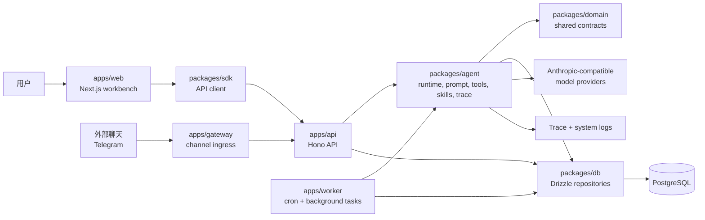

# my-agent-proj

`my-agent-proj` 是一个以 `TypeScript` + `Bun` 为主栈的个人助手 agent runtime。它围绕工作区理解、文件操作、工具编排、权限等待、可观测执行、后台任务和 session settings 持久化构建。

仓库采用轻量全栈 monorepo：Next.js workbench 通过 SDK 调用 Hono API，API 装配 agent runtime，PostgreSQL 保存 session、settings、routine、cron job、inbox binding 和 background task 状态。

## 架构



完整组件图、session 执行链路和后台任务链路见 [docs/architecture/diagram.md](./docs/architecture/diagram.md)。

## 仓库结构

- `apps/web`：交互式 workbench、会话 UI、trace 和 session 检查
- `apps/api`：session 生命周期、执行入口、settings、trace、system logs、cron jobs、Telegram inbox endpoints
- `apps/gateway`：外部常驻 channel 入口，当前负责 Telegram polling
- `apps/worker`：cron dispatch 与 detached background task 执行
- `packages/agent`：runtime loop、prompt assembly、model providers、tools、permissions、skills、MCP、LSP、trace
- `packages/db`：PostgreSQL schema、Drizzle migrations、repositories、database client
- `packages/domain`：settings、context、permission、cron、inbox、background-task 等共享契约

## 快速启动

```bash
bun install
cp .env.example .env
bun dev
```

`bun dev` 会加载 `.env`，检查 `DATABASE_URL` 指向的 PostgreSQL；当它指向本地且数据库未启动时，会自动初始化并拉起本地数据库，然后一起启动 API、Web、Gateway、Worker 和 packages watcher。

默认本地入口：

- Web workbench：`http://localhost:3000`
- API health check：`http://localhost:3001/health`

环境变量、smoke 命令、单服务启动方式和 runtime 调试流程见 [docs/development.md](./docs/development.md)。

## 文档

- [开发与调试](./docs/development.md)
- [文档索引](./docs/README.md)
- [技术栈总览](./docs/tech-stack.md)
- [架构文档目录](./docs/architecture/README.md)
- [设计系统总览](./docs/design-system/README.md)
- [模板初始化说明](./docs/template/README.md)

历史阶段规划保留在 [docs/plan](./docs/plan/README.md)。判断当前实现时，优先看架构文档和 [docs/development.md](./docs/development.md) 里的事实源清单。
