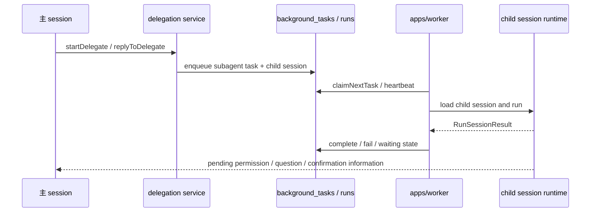

# 后台任务与 delegation

## 定位

这条链路负责把“当前会话之外的执行”单独拆出来：

- `apps/worker` 轮询并执行后台任务
- `packages/agent/src/background-tasks/` 负责任务管理和运行编排
- `packages/agent/src/delegation/` 负责主 agent 发起、查询和回复 delegated subagent
- `packages/domain` 和 `packages/db` 负责后台任务与 delegate 相关的领域模型和持久化

它不是通用队列系统，也不是 cron 平台。当前只覆盖 agent 需要的 detached subagent 执行和少量后台任务状态流转。

## 关键模块

```text
apps/worker/src/index.ts
packages/agent/src/background-tasks/
packages/agent/src/delegation/
packages/domain/src/background-task.ts
packages/domain/src/routine.ts
packages/db/src/background-task-repository.ts
packages/db/src/schema.ts
```

职责大致如下：

- `apps/worker/src/index.ts`：轮询 `background_tasks`，claim 任务，拉起 child session runtime，做心跳和取消协作
- `packages/agent/src/background-tasks/manager.ts`：封装 enqueue、claim、heartbeat、complete、fail、cancel 等状态变更
- `packages/agent/src/background-tasks/runner.ts`：执行 claim 到的 child session，并把等待用户输入 / 等待主 agent 回复的状态回写给任务层
- `packages/agent/src/delegation/service.ts`：给主 agent 提供 `startDelegate`、`replyToDelegate`、`resolveDelegatePermission` 之类的业务接口
- `packages/domain/src/background-task.ts`：定义任务 kind、status、payload、delegate task card 和 response envelope

## 当前任务模型

现在的后台任务 kind 只有两类：

- `cron_job`
- `subagent`

但当前真正落地执行后端的是 `agent_session`，也就是用独立 child session 跑任务。`cron_job` 还没有对外 HTTP 接口。

## 运行链路



## 状态边界

后台任务和主 session 共享数据库，但不共享消息历史：

- 任务记录保存执行状态、payload、task card 和结果摘要
- child session 保存真正的 runtime 历史和 trace
- delegated subagent 如果需要人类介入，会通过 `pendingPermissionRequest`、`pendingUserQuestionPayload` 或 `pendingConfirmationPayload` 回传给主 agent

## 现在不做的事

- 不把后台任务做成通用工作队列
- 不提供公开的 background task HTTP API
- 不做 cron 调度面板
- 不把 delegation 混成普通聊天消息

## 推荐事实源

- worker 装配：`apps/worker/src/index.ts`
- task manager：`packages/agent/src/background-tasks/manager.ts`
- task runner：`packages/agent/src/background-tasks/runner.ts`
- delegation service：`packages/agent/src/delegation/service.ts`
- task 领域：`packages/domain/src/background-task.ts`
- task 持久化：`packages/db/src/schema.ts`
