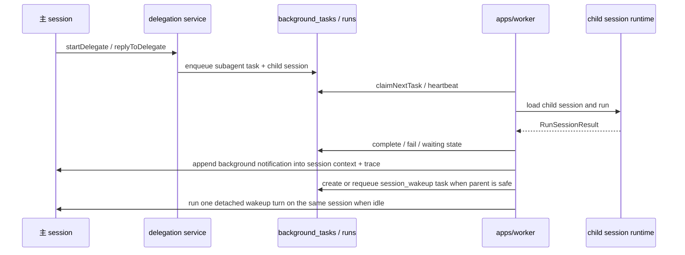

# 后台任务与 delegation

## 定位

这条链路负责把“当前会话之外的执行”单独拆出来：

- `apps/worker` 轮询并执行后台任务
- `packages/agent/src/background-tasks/` 负责任务管理和运行编排
- `packages/agent/src/delegation/` 负责主 agent 发起、查询和回复 delegated subagent
- `packages/domain` 和 `packages/db` 负责后台任务与 delegate 相关的领域模型和持久化

它不是通用队列系统，也不是 cron 平台。当前只覆盖 agent 需要的 detached subagent 执行和少量后台任务状态流转。

## 关键模块

```text
apps/worker/src/index.ts
packages/agent/src/background-tasks/
packages/agent/src/delegation/
packages/domain/src/background-task.ts
packages/domain/src/routine.ts
packages/db/src/background-task-repository.ts
packages/db/src/schema.ts
```

职责大致如下：

- `apps/worker/src/index.ts`：轮询 `background_tasks`，claim 任务，拉起 child session runtime，做心跳和取消协作
- `packages/agent/src/background-tasks/manager.ts`：封装 enqueue、claim、heartbeat、complete、fail、cancel 等状态变更
- `packages/agent/src/background-tasks/runner.ts`：执行 claim 到的 child session，并把等待用户输入 / 等待主 agent 回复的状态回写给任务层
- `packages/agent/src/delegation/service.ts`：给主 agent 提供 `startDelegate`、`replyToDelegate`、`resolveDelegatePermission` 之类的业务接口
- `packages/domain/src/background-task.ts`：定义任务 kind、status、payload、delegate task card 和 response envelope

## 当前任务模型

现在的后台任务 kind 有三类：

- `cron_job`
- `subagent`
- `session_wakeup`

但当前真正落地执行后端的是 `agent_session`，也就是用独立 child session 跑任务。`cron_job` 还没有对外 HTTP 接口。

## 运行链路



## 状态边界

后台任务和主 session 共享数据库，但不共享消息历史：

- 任务记录保存执行状态、payload、task card 和结果摘要
- child session 保存真正的 runtime 历史和 trace
- 主 session context 会维护 `pendingBackgroundNotifications`，作为待主 agent 处理的后台结果事实源
- delegated subagent 如果需要人类介入，会通过结构化后台通知把 `pendingPermissionRequest`、`pendingUserQuestionPayload` 或 `pendingConfirmationPayload` 摘要回注给主 agent
- 这些通知不会伪造成用户消息，也不会把 child session 历史直接灌回主 session

## 现在不做的事

- 不把后台任务做成通用工作队列
- 不提供公开的 background task HTTP API
- 不做 cron 调度面板
- 不把 delegation 混成普通聊天消息

## 唤醒与超时语义

- `subagent` 完成、失败、取消、超时、或 `waiting_for_main_agent` 时，worker 都会向父会话注入结构化后台通知
- 父会话只有在未执行中，且不处于 `waiting_for_permission`、`waiting_for_conflict_confirmation`、`waiting_for_user_question` 这三类显式人类门控时，才会自动续跑一小轮
- 如果父会话正等待人类输入，只保留通知并让前端提示，不抢跑
- `delegate_agent` 支持 `wait_mode=blocking|unblocking`；默认 `blocking`
- `blocking` 下，主会话在同步调用 `delegate_agent` 后如果只拿到 `queued` / `running` 这类活跃状态，会立即结束当前 run，不在同一次 run 内继续轮询
- `unblocking` 下，主会话会先继续处理同轮其他工具调用或后续模型回合；当没有其他可推进工作时，再主动结束当前 run，并安排 `delegate_poll` 类型的 `session_wakeup`
- `delegate_poll` 的首次检查时间来自 `initial_check_after_ms`，之后指数退避，单次间隔最多 120 秒；轮询本身不消耗主模型 turn
- `session_wakeup` 会复用主会话自己的 `sessionId` 作为 child session，避免为同一个主会话反复创建新唤醒任务
- `subagent` 和 `session_wakeup` 都带 `deadlineAt` / `attemptCount` / `maxAttempts`
- 对这两类任务，worker 心跳过期或超过 deadline 后不会静默重试；会直接失败并向主会话注入失败通知

## 推荐事实源

- worker 装配：`apps/worker/src/index.ts`
- task manager：`packages/agent/src/background-tasks/manager.ts`
- task runner：`packages/agent/src/background-tasks/runner.ts`
- delegation service：`packages/agent/src/delegation/service.ts`
- task 领域：`packages/domain/src/background-task.ts`
- task 持久化：`packages/db/src/schema.ts`
