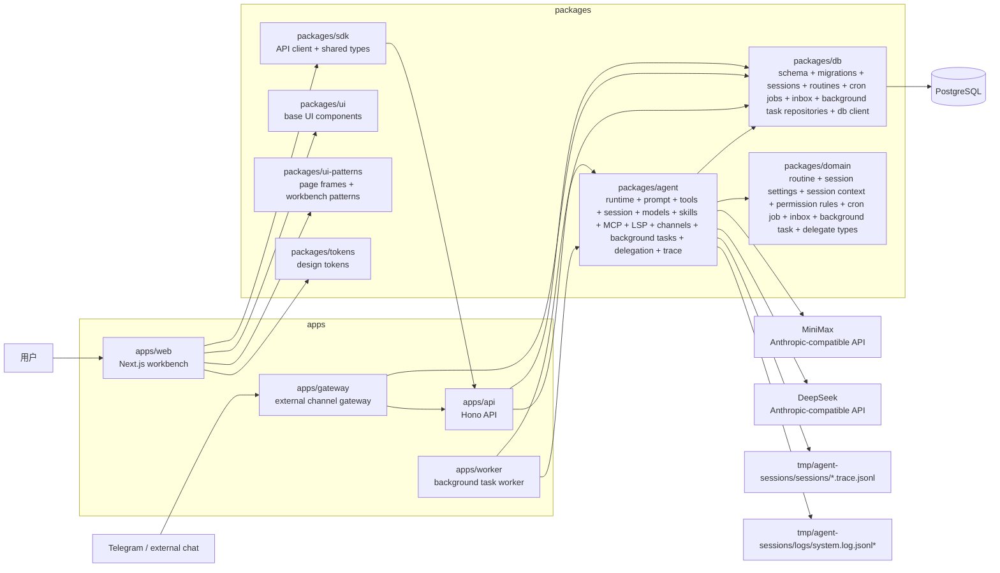
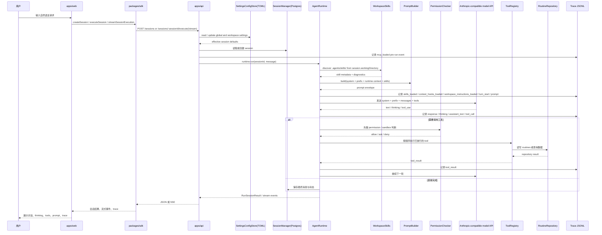
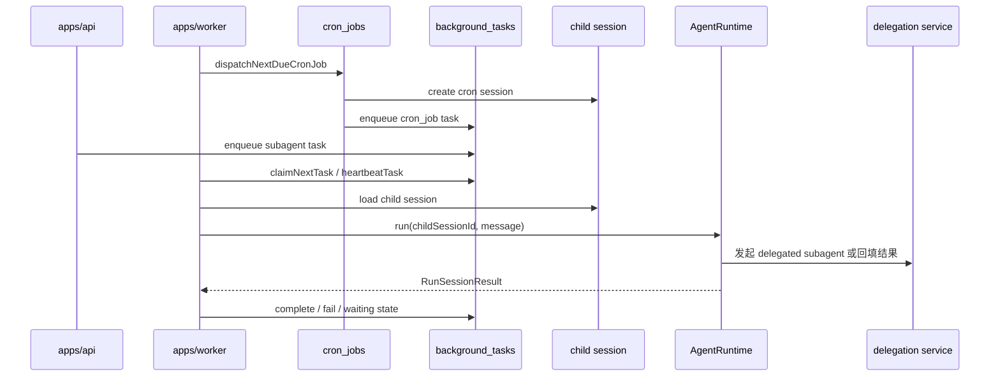

# 架构图

这份文档用 Mermaid 描述当前仓库已经落地的系统结构，以及一次 session 执行时的主要数据流。

## 系统组件图

## 一次 session 的执行链路

## 后台任务链路

## 读图提示

- `apps/api` 是当前运行主入口，负责把各层装配起来
- `apps/worker` 负责 cron job dispatch，以及 detached background task 的轮询、认领和执行
- `apps/gateway` 负责 Telegram polling 这类常驻外部接入，再把 update 转发给 API webhook
- `packages/agent` 是执行核心，既包含 runtime loop，也包含 prompt、session、skills、MCP、LSP、channels、tools 和 trace
- `packages/ui-patterns`、`packages/ui` 和 `packages/tokens` 是 `apps/web` 的共享视觉与布局层
- tool 执行前还有独立的 permission checker；待批准请求和业务确认流是分开建模的
- `PostgreSQL` 保存 session、routine、cron job、inbox binding 与 background task 数据，`tmp/` 主要保存 trace 与 system logs
- `SettingsConfigStore` 统一读取 `~/.agents/config.toml` 与 workspace `.agents/config.toml`，提供单租户 session settings
