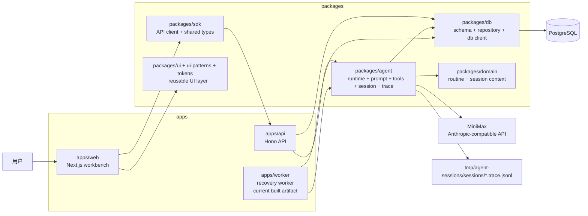
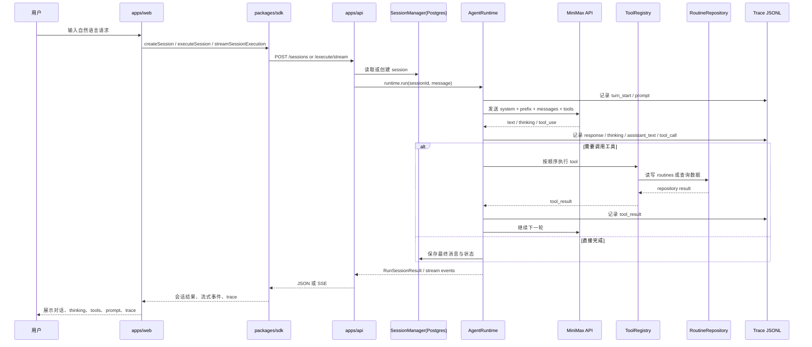

# 架构图

这份文档用 Mermaid 描述当前仓库已经落地的系统结构，以及一次 session 执行时的主要数据流。

## 系统组件图

## 一次 session 的执行链路

## 读图提示

- `apps/api` 是当前运行主入口，负责把各层装配起来
- `packages/agent` 是执行核心，既包含 runtime loop，也包含 prompt、session、tools 和 trace
- `PostgreSQL` 保存 session 与 routine 数据，`tmp/` 主要保存 trace
