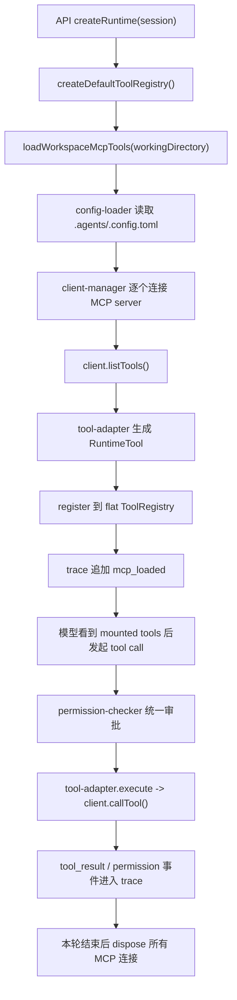

# MCP 模块落地

## 定位

`MCP` 在当前仓库里不是一个独立产品面，而是 `agent runtime` 的工作区级动态扩展层：

- 配置来源是 `session.workingDirectory/.agents/.config.toml`
- 装配时机是每次 session runtime 创建前；`apps/api` 和 `apps/worker` 都会走这条链路
- 暴露形态是挂进当前 `ToolRegistry` 的一组运行时工具
- 生命周期只覆盖当前一次运行，不写入数据库，也不作为 session 持久状态保存

这意味着它更接近“本轮运行按工作区派生的工具上下文”，而不是全局插件系统。

## 当前职责边界

当前 MCP 模块只负责四件事：

1. 从工作区读取并校验 `.agents/.config.toml`
2. 连接 `stdio` / `http` MCP server，并拉取工具定义
3. 把 MCP tool 适配成 runtime 内部统一的 `RuntimeTool`
4. 在 trace 中记录加载结果，并在本轮执行结束后释放连接

当前不做：

- 向父目录递归查找配置
- 多份配置 merge
- resource / prompt / sampling 等非 tool 能力接入
- 把 MCP 连接持久化到 session 或数据库
- 为 MCP 单独做 UI 配置面板

## 模块归属

```text
packages/agent/src/mcp/
  config-types.ts
  config-loader.ts
  sdk-loader.ts
  client-manager.ts
  tool-adapter.ts

apps/api/src/index.ts
apps/worker/src/index.ts
packages/agent/src/tools/registry.ts
packages/agent/src/runtime/permission-checker.ts
packages/agent/src/runtime/permission.ts
packages/agent/src/trace.ts
```

各文件职责如下：

- `config-types.ts`：MCP 配置、诊断和加载结果类型
- `config-loader.ts`：读取并解析 `.agents/.config.toml`
- `sdk-loader.ts`：动态加载 `@modelcontextprotocol/sdk` 运行时模块
- `client-manager.ts`：连接 server、拉取 tool、汇总 server 级加载结果
- `tool-adapter.ts`：把 MCP tool 转成统一 `RuntimeTool`
- `apps/api/src/index.ts`：把 MCP tool 注册进本轮 runtime，并在结束时 `dispose`

## 运行链路



关键点：

- `MCP` 工具和内置工具共用同一个 `flat tool registry`
- prompt 不额外注入 MCP 专项长说明，模型只通过本轮实际挂载的工具列表感知它们
- MCP 加载发生在 runtime 创建阶段，而不是模型回合中途懒加载

## 配置协议

当前只认工作目录下这一份文件：

```text
<workingDirectory>/
  .agents/
    .config.toml
```

顶层协议是：

```toml
[mcp_servers.notes]
enabled = true
command = "node"
args = ["./notes-mcp.js"]
env = { FOO = "bar" }
disabled_tools = ["dangerous_write"]

[mcp_servers.browser]
enabled = false
url = "http://127.0.0.1:8123/mcp"
headers = { Authorization = "Bearer xxx" }
```

规则如下：

- 有 `command` 就按 `stdio` 处理
- 有 `url` 就按 `http` 处理
- `enabled` 可选，默认 `true`；设为 `false` 时该 server 不会在运行前连接和挂载
- `disabled_tools` 可选，按 MCP 原始 tool name 记录禁用的子工具；server 仍会连接并列出工具，但禁用项不会注册进本轮 `ToolRegistry`
- `stdio` 只允许 `command` / `args` / `env` / `enabled` / `disabled_tools`
- `http` 只允许 `url` / `headers` / `enabled` / `disabled_tools`
- `url` 只能是绝对 `http://` 或 `https://`
- 重名 server、非法字段、类型错误、TOML 语法错误都会进入 `diagnostics`

失败策略是“尽量跳过坏配置，不阻断内置 runtime”：

- 文件不存在：认为本轮没有工作区 MCP 配置
- 某个 server 非法：只跳过该 server
- 某个 server 连接失败：记录失败摘要，其余 server 继续加载
- 内置工具照常可用

## Tool 适配约定

每个 MCP tool 都会被转换成统一的 `RuntimeTool`，并遵守当前 runtime 约定：

- 工具名统一命名为 `mcp__<server>__<tool>`
- server 名和 tool 名会先做小写化与字符清洗，只保留 `[a-z0-9_]`
- `inputSchema` 直接透传 MCP tool 的 schema
- `description` 优先取 MCP 定义里的 `description` 或 `title`
- `family` 固定为 `mcp`
- `permissionProfile` 固定为 `always-ask-user`
- `sandboxProfile` 固定为 `none`

这里有两个重要含义：

1. MCP 工具进入 runtime 后，和内置工具共用统一的调用/trace/权限框架
2. 当前实现没有在 runtime 里对 MCP 工具再套一层工作区文件沙箱，边界主要依赖审批而不是沙箱

## 权限与交互

当前 MCP 工具默认总是审批：

- `permission-checker` 会把 `family === "mcp"` 视为高风险工具
- fallback summary 是“需要你的确认后才能调用 MCP 工具”
- `YOLO mode` 不绕过 MCP 审批
- 用户批准后，工具调用继续在当前回合恢复执行

和 shell / workspace file 的区别：

- workspace file 工具有额外的工作目录沙箱预检
- shell 工具可以被 `shellAllowPatterns` 等规则细化
- MCP 当前只有统一的 `always-ask-user` 策略，没有按 server / tool 的差异化权限模型

## 结果映射

`tool-adapter` 会把 MCP 返回值压平到当前 runtime 的 `ToolResult` 结构：

- 有 `content` 时，文本会被摘要成 `message`
- `image` / `audio` / `resource` 会保留结构化摘要
- 有 `structuredContent` 时会保留到 `data`
- MCP 声明式错误会映射成 `MCP_TOOL_ERROR`
- transport / 调用异常会映射成 `MCP_TRANSPORT_ERROR`

task-style MCP 结果如果没有 `content`，当前会走兼容分支，写成 `MCP_TOOL_TASK_RESULT`。

## 可观测性

当前 trace 已把 MCP 放进主线：

- 每次运行前会追加一条 `mcp_loaded`
- 事件里包含：
  - `configPath`
  - `foundConfig`
  - `diagnostics`
  - `servers`，包括 server 加载状态、已挂载工具名，以及可列出的子工具启用状态
- MCP tool 真正执行时，后续仍走统一的：
  - `tool_call`
  - `permission_request`
  - `permission_approved` / `permission_rejected`
  - `tool_result`

所以排查 MCP 问题时，优先看两层：

1. 本轮是否成功装配进 registry
2. 装配成功后，是否在权限或 transport 调用阶段失败

## 生命周期与释放

MCP 连接不是单例，也不跨回合复用：

- `apps/api/src/index.ts` 在 `createRuntime(session)` 内调用 `loadWorkspaceMcpTools()`
- `apps/worker/src/index.ts` 在 background task runtime 创建时也调用同一入口
- 本轮执行完成后通过 `runtimeHandle.dispose()` 关闭连接
- 对 `StreamableHTTPClientTransport` 会先尝试 `terminateSession()`
- 无论关闭过程中是否出错，都会吞掉清理异常，避免影响主流程收尾

这种做法的优点是边界清晰、session 不背连接状态；代价是每轮都会重新建连。

## 当前约束

以下都是当前实现已经存在、文档需要明确写下来的约束：

- server 是串行连接，不是并发加载
- MCP 只在运行前装配，不支持运行中热更新
- Settings 面板可以读写当前默认工作目录的 server / 子工具启用状态，但修改后仍在下一次 run 才会重新装配
- prompt 不会额外解释某个 MCP server 的专项语义，模型只能靠工具名和描述理解
- 如果 namespaced 后的工具名和已有工具重名，`ToolRegistry.register()` 会直接抛错，本轮 runtime 装配失败
- 当前没有针对 MCP server 的健康检查缓存、重试策略和连接池

## 推荐事实源

- 工作区配置边界：`docs/architecture/workspace-agent-config.md`
- 配置类型：`packages/agent/src/mcp/config-types.ts`
- 配置解析：`packages/agent/src/mcp/config-loader.ts`
- SDK 动态加载：`packages/agent/src/mcp/sdk-loader.ts`
- server 连接与工具挂载：`packages/agent/src/mcp/client-manager.ts`
- tool 适配：`packages/agent/src/mcp/tool-adapter.ts`
- runtime 装配：`apps/api/src/index.ts`
- 权限检查：`packages/agent/src/runtime/permission-checker.ts`
- trace 事件：`packages/agent/src/trace.ts`

## 后续扩展建议

如果接下来要继续做 MCP，这条顺序最稳妥：

1. 先补工具重名冲突与 server 加载并发策略
2. 再决定是否需要 server 级权限模型，例如 `allow / ask / deny`
3. 再评估 resource / prompt 等非 tool 能力是否真的进入主线
4. 最后再考虑 UI 配置、连接复用和 user-level secret 管理

这样可以先把当前“按次挂载 MCP 工具”的主链路打稳，再决定要不要把它做成更重的插件系统。
